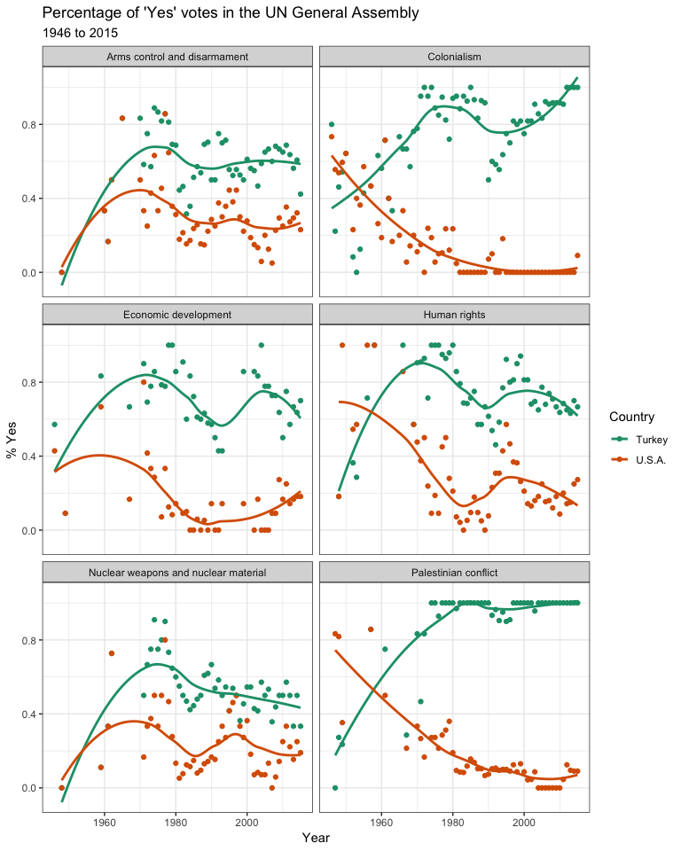

Intro to Github HW
================
Your Name Goes Here
1/7/2019

Load Libraries
--------------

Insert a code chunk to load the `tidyverse`, `unvotes`, and `lubridate` packages. Use the `knitr` option `include = FALSE`.

Plot the Data
-------------

Choose a country in the data set and replicate what we did in class by substituting that country for Australia. Knit the document so that a new `github-intro.md` file is created, add it to the repo, commit it, and push it to github.

Next, I'll either import and/or manipulate date and, again, I won't include this chunk in the document. See the `.Rmd` file for the data manipulation code.

``` r
un_votes_joined <- un_votes %>%
  filter(country %in% c("United States of America", "Turkey")) %>%
  inner_join(un_roll_calls, by = "rcid") %>%
  inner_join(un_roll_call_issues, by = "rcid") %>%
  group_by(country, year = year(date), issue) %>%
  summarize(
    votes = n(),
    percent_yes = mean(vote == "yes")
  ) %>%
  filter(votes > 5) # only use records where there are more than 5 votes
```

    ## Warning: Column `rcid` has different attributes on LHS and RHS of join

    ## Warning: Column `rcid` has different attributes on LHS and RHS of join

Finally, I will write the document by weaving text with code. For example, Figure 1 illustrates how the US and Australia have voted in the UN on various issues.


